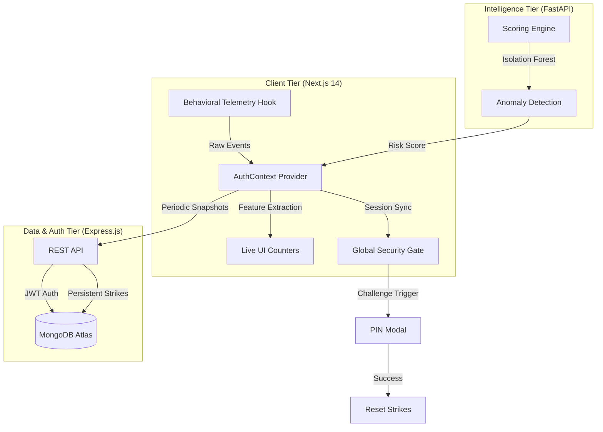

# 🛡️ BehaveGuard
### **Continuous Behavioral Authentication & Intelligence Engine**

[](https://github.com/Kanishka-Trivedi/CRAFTATHON_GU)
[](https://github.com/Kanishka-Trivedi/CRAFTATHON_GU)
[](https://github.com/Kanishka-Trivedi/CRAFTATHON_GU)

---

## 💎 The Vision
**BehaveGuard** is a next-generation security layer for banking that moves beyond static passwords. By capturing the **"Mathematical Rhythm"** of human interaction—how you type, move your mouse, and scroll—we create a persistent biological signature that is nearly impossible to spoof.

> *"We don't just verify who you are when you log in; we verify who you are every second you are logged in."*

---

## 🏗️ System Architecture



---

## 🌟 Key Innovations

### 1. **Live Interaction DNA Feed**
*   **Keystroke Dynamics**: Captures Typing Speed (CPS), Key Hold Times, and Flight Latency.
*   **Motion Entropy**: Monitors Mouse Velocity, Acceleration, and Click Deviations.
*   **Scroll Depth**: Analyzes reading patterns and navigation rhythms.

### 2. **Continuous ML Scoring (2-Second Window)**
Unlike traditional systems that only check at login, BehaveGuard runs an **Isolation Forest** ML model in the background. It evaluates your behavior every 2 seconds, producing a "Trust Score" (0-100%).

### 3. **Persistent Security Gating**
*   **Risk Escalation**: If the trust score drops below 40%, the system enters **Danger Mode**.
*   **Strike Tracking**: Security anomalies are persisted in MongoDB. Refreshing the page or switching devices will **not** reset your security status.
*   **Adaptive Challenge**: Triggers a 2FA PIN challenge or a total account lockdown based on the strike count.

### 4. **SOC (Security Operations Center) Dashboard**
A professional administrative hub for monitoring network health:
*   **Live Telemetry Terminal**: Real-time stream of behavioral events.
*   **Operational Logs**: Detailed audit trail of every security incident.
*   **Trust Restoration**: Administrators can manually clear strikes and restore user trust.

---

## 🛠️ Technology Stack

| Layer | Technologies |
| :--- | :--- |
| **Frontend** | Next.js 14 (App Router), Tailwind CSS, Framer Motion, Chart.js |
| **ML Engine** | Python 3.10, FastAPI, Scikit-Learn (Isolation Forest), Pandas |
| **Backend** | Node.js, Express.js, Mongoose, JWT, Nodemailer |
| **Database** | MongoDB Atlas (Cloud) |
| **Identity** | Behavioral Biometrics (Keystroke & Pointer Dynamics) |

---

## 📂 Project Structure

```text
├── src/                    # Next.js Frontend
│   ├── app/                # App Router (Dashboard, Admin, Passport)
│   ├── components/         # Shared UI (MagicBento, GlobalSpotlight)
│   ├── context/            # AuthContext (Telemetry Engine)
│   └── assets/             # Branding & Icons
├── backend/                # Node.js API
│   ├── models/             # Mongoose Schemas (User, Session)
│   ├── routes/             # Auth & Behavioral Sync logic
│   └── utils/              # Mail & Security helpers
└── behaviorauth/           # Python ML Engine
    ├── api/                # FastAPI Routes
    ├── models/             # Trained ML Model Snapshots
    └── notebooks/          # Research & Development
```

---

## 🚦 Installation & Setup

### 1. Prerequisites
- **Node.js** v18+
- **Python** 3.10+
- **MongoDB** (Local or Atlas)

### 2. Environment Configuration
Create a `.env` file in both `root` and `/backend`:
```env
MONGO_URI=your_mongodb_url
JWT_SECRET=senior_dev_secret
NEXT_PUBLIC_ML_ENGINE_URL=http://localhost:8001
```

### 3. Launching the Ecosystem

**Step 1: Backend API**
```bash
cd backend && npm install && node server.js
```

**Step 2: ML Engine**
```bash
cd behaviorauth && pip install -r requirements.txt
uvicorn api.main:app --reload --port 8001
```

**Step 3: Frontend**
```bash
npm install && npm run dev
```

---

## 🛡️ Security Philosophy: Zero Storage
We adhere to **GDPR-compliant security**. We never store raw biometric data (what you typed or where you clicked). We only store the **mathematical variance** from your baseline, ensuring your privacy is as un-spoofable as your identity.

---
**Developed for CRAFTATHON_GU**  
*Senior Developer Audit Completed - 2026*